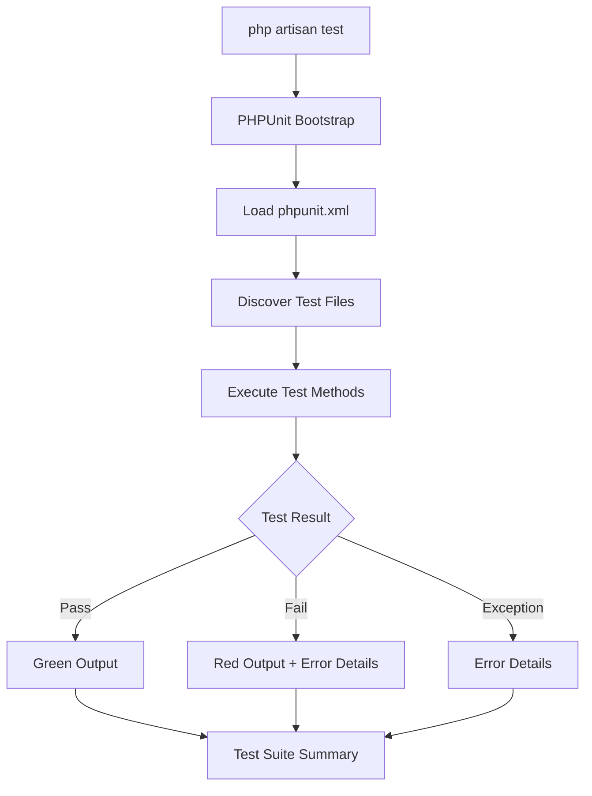

# Testing Documentation - TierOne Orders API

## Overview
This document provides comprehensive testing documentation for the TierOne Orders API challenge, demonstrating TDD (Test-Driven Development) practices and Laravel testing capabilities.

## Table of Contents
1. [PHPUnit: The Testing Framework](#phpunit-the-testing-framework)
2. [Testing Strategy](#testing-strategy)
3. [Test Structure](#test-structure)
4. [Running Tests](#running-tests)
5. [Test Cases](#test-cases)
6. [Test Results](#test-results)
7. [Testing Best Practices](#testing-best-practices)

---

## PHPUnit: The Testing Framework

### What is PHPUnit?

PHPUnit is the standard unit testing framework for PHP. It provides a complete testing infrastructure for PHP applications, allowing developers to write testable code, verify functionality, and prevent regressions.

### Installation

PHPUnit is installed automatically when you create a Laravel project using Composer.

```bash
# In composer.json, PHPUnit is listed under require-dev
"require-dev": {
    "phpunit/phpunit": "^11.0.1"
}
```

Installation happens during:
```bash
# This command installs all dependencies including PHPUnit
composer install
```

### Why PHPUnit is Included

Laravel includes PHPUnit out of the box because:
- **Industry Standard**: Most widely used testing framework in PHP
- **Laravel Integration**: Seamless integration with Laravel's testing features
- **Test Traits**: Laravel provides testing traits like `RefreshDatabase`, `WithFaker`, etc.
- **Artisan Integration**: Can run tests with `php artisan test`

### Configuration File: `phpunit.xml`

The project uses `phpunit.xml` for configuration:

```xml
<?xml version="1.0" encoding="UTF-8"?>
<phpunit xmlns:xsi="http://www.w3.org/2001/XMLSchema-instance"
         xsi:noNamespaceSchemaLocation="vendor/phpunit/phpunit/phpunit.xsd"
         bootstrap="vendor/autoload.php"
         colors="true"
>
    <testsuites>
        <testsuite name="Unit">
            <directory>tests/Unit</directory>
        </testsuite>
        <testsuite name="Feature">
            <directory>tests/Feature</directory>
        </testsuite>
    </testsuites>
    <!-- ... environment settings ... -->
</phpunit>
```

**Key Configuration Elements:**

1. **`bootstrap="vendor/autoload.php"`**: 
   - Loads Composer's autoloader
   - Makes all classes available to tests

2. **`colors="true"`**:
   - Enables colored output for test results (green for pass, red for fail)

3. **`<testsuites>`**:
   - Defines test suites (Unit and Feature)
   - PHPUnit looks for tests in `tests/Unit/` and `tests/Feature/`

4. **`<env>`**:
   - Sets environment variables for tests
   - `APP_ENV=testing`: Laravel knows it's in test mode
   - `DB_CONNECTION=mysql`: Uses MySQL for tests
   - `DB_DATABASE=tierone_orders`: Test database name

### How PHPUnit Works Internally

#### 1. Test Discovery
```bash
php artisan test
```

**Process:**
1. Laravel's `TestCommand` calls PHPUnit
2. PHPUnit reads `phpunit.xml` configuration
3. Scans directories defined in `<testsuites>`
4. Finds all `*Test.php` files in `tests/Unit/` and `tests/Feature/`
5. Identifies test methods (methods starting with `test_` or annotated with `@test`)

#### 2. Test Execution Flow



#### 3. Laravel Testing Features

When running `php artisan test`, Laravel provides:

**Automatic Laravel Bootstrapping:**
```php
// tests/TestCase.php
abstract class TestCase extends BaseTestCase {
    use CreatesApplication; // Boots Laravel for each test
}
```

**Test Traits Available:**
- `RefreshDatabase`: Resets database after each test
- `WithFaker`: Generates fake data
- `AssertApplicationIsNotDown`: Verifies app is running
- Database transactions for isolation

#### 4. Test Method Execution

```php
// Example: tests/Feature/AuthTest.php
public function test_user_can_register(): void
{
    // 1. Laravel boots the application
    // 2. Sets up database (RefreshDatabase trait)
    // 3. Executes test code
    $response = $this->postJson('/api/auth/register', [...]);
    
    // 4. PHPUnit assertions
    $response->assertStatus(201);
    
    // 5. Laravel cleans up (database reset)
}
```

**What happens inside PHPUnit:**
1. Creates test instance
2. Calls `setUp()` method (Laravel bootstraps here)
3. Executes test method
4. Calls assertions
5. Calls `tearDown()` method (Laravel cleans up)
6. Reports result

### Why We Use `php artisan test` Instead of Direct PHPUnit

#### Traditional PHPUnit Command:
```bash
./vendor/bin/phpunit tests/Feature/AuthTest.php
```

#### Laravel's Enhanced Command:
```bash
php artisan test
```

**Advantages of `php artisan test`:**

1. **Laravel Bootstrap**: Automatically loads Laravel framework
   - Sets up service container
   - Loads configuration
   - Initializes database

2. **Better Output**: 
   - Colored output
   - Progress indicators
   - Detailed error messages

3. **Laravel-Specific Features**:
   - Database testing helpers
   - HTTP testing helpers
   - Mocking helpers

4. **Filtering**:
   ```bash
   php artisan test --filter AuthTest
   php artisan test tests/Feature/
   ```

5. **Parallel Execution**:
   ```bash
   php artisan test --parallel
   ```

#### What Happens When You Run `php artisan test`?

```bash
# 1. Laravel reads command
php artisan test

# 2. Laravel's TestCommand class executes
Illuminate\Foundation\Console\TestCommand

# 3. Resolves PHPUnit test runner
vendor/phpunit/phpunit/bin/phpunit

# 4. Passes arguments to PHPUnit
--configuration=phpunit.xml
--do-not-cache-result
--prepend=tests/bootstrap.php

# 5. PHPUnit executes with Laravel's enhancements
```

**Behind the Scenes:**
```php
// Laravel's TestCommand internals
class TestCommand {
    protected function execPHPUnit() {
        return $this->phpUnit = new Process($this->phpUnitArguments, ...);
    }
}
```

### Test Assertions

PHPUnit provides many assertion methods:

```php
// Status assertions (Laravel HTTP)
$response->assertStatus(200);
$response->assertCreated();
$response->assertUnauthorized();

// JSON structure
$response->assertJson(['key' => 'value']);
$response->assertJsonStructure(['key' => ['nested']]);

// Database assertions (Laravel)
$this->assertDatabaseHas('users', ['email' => 'test@example.com']);
$this->assertDatabaseCount('orders', 5);

// Standard PHPUnit assertions
$this->assertEquals($expected, $actual);
$this->assertTrue($condition);
$this->assertNotNull($value);
```

### Test Isolation

Each test runs in isolation:

```php
public function test_one(): void 
{
    // Creates data in database
    User::factory()->create();
    
    // Test completes
} 
// Database is reset automatically

public function test_two(): void 
{
    // Database is clean - no data from test_one
    $this->assertDatabaseCount('users', 0);
}
```

**How Laravel Ensures Isolation:**

1. `RefreshDatabase` trait:
   - Runs migrations before each test
   - Wraps tests in database transactions
   - Rolls back changes after test

2. Environment isolation:
   - Uses `APP_ENV=testing`
   - Separate cache/session from production

3. Dependency injection:
   - Each test gets fresh instances
   - Services are resolved per test

### Configuration Summary

**Project Setup:**
- **Framework**: PHPUnit 11.0.1
- **Installation**: Via Composer (included with Laravel)
- **Configuration**: `phpunit.xml`
- **Test Files**: `tests/Unit/` and `tests/Feature/`
- **Command**: `php artisan test`

**Why This Configuration:**

1. **MySQL for Tests**: 
   - Uses same database technology as production
   - Ensures compatibility
   - Tests realistic database interactions

2. **Two Test Suites**:
   - **Unit**: Tests individual components (services, models)
   - **Feature**: Tests complete functionality (HTTP requests)

3. **Laravel Integration**:
   - Leverages Laravel's testing helpers
   - Automatic database setup/teardown
   - HTTP testing simplified

### Running Tests Internally

When you execute:
```bash
php artisan test
```

**Internal Process:**

1. **Laravel Test Command** (`app/Console/Commands/TestCommand.php`):
   - Parses arguments
   - Sets up PHPUnit process
   - Configures environment

2. **PHPUnit Execution** (`vendor/bin/phpunit`):
   - Reads `phpunit.xml`
   - Discovers tests
   - Runs test suite

3. **Test Execution**:
   ```php
   foreach ($testFiles as $file) {
       $testCase = new AuthTest();
       $testCase->test_user_can_register();
       // Reports result
   }
   ```

4. **Laravel Bootstrap** (`tests/bootstrap.php`):
   ```php
   $app = require_once __DIR__.'/../bootstrap/app.php';
   $kernel = $app->make(Kernel::class);
   // Laravel is ready
   ```

5. **Result Reporting**:
   - PHPUnit generates output
   - Laravel enhances formatting
   - Shows summary: "Tests: 26 passed"

### Summary

**PHPUnit Integration:**
- Installed via Composer
- Configured in `phpunit.xml`
- Integrated with Laravel via `php artisan test`
- Provides full testing infrastructure

**Why `php artisan test`:**
- Better than direct PHPUnit (`./vendor/bin/phpunit`)
- Includes Laravel-specific features
- Automatic bootstrapping
- Enhanced output and filtering
- Database isolation via `RefreshDatabase`
- HTTP testing capabilities

**Test Execution:**
- PHPUnit discovers tests
- Laravel bootstraps application
- Tests run in isolated environment
- Database resets between tests
- Results are reported with details

---

## Testing Strategy

### Approach
- **TDD Mindset**: Tests demonstrate understanding of Laravel testing
- **Minimal Testing**: Focus on essential functionality for challenge
- **Multiple Layers**: Feature tests, Unit tests, and Basic API tests
- **Real-world Scenarios**: Cover authentication, authorization, and business logic

### Test Types Implemented
1. **Feature Tests**: End-to-end API functionality
2. **Unit Tests**: Service layer business logic
3. **Basic API Tests**: Core API behavior without database dependencies

---

## Test Structure

### File Organization
```
tests/
├── Feature/
│   ├── AuthTest.php           # Complete authentication tests
│   ├── OrderTest.php          # Complete order management tests
│   ├── BasicApiTest.php       # Basic API functionality tests
│   ├── SimpleAuthTest.php     # Simplified authentication tests
│   └── StaffRegistrationTest.php # Staff registration tests
├── Unit/
│   └── OrderServiceTest.php   # Service layer unit tests
└── TestCase.php               # Base test class

database/factories/
├── UserFactory.php            # User model factory
├── OrderFactory.php           # Order model factory
└── ClientFactory.php          # Client model factory
```

### Configuration
- **Database**: MySQL database for testing (same as development)
- **Environment**: Testing environment with optimized settings
- **RefreshDatabase**: Ensures clean state for each test
- **Client-User Separation**: Tests reflect the new multi-tenancy model

---

## Running Tests

### Prerequisites
```bash
# Ensure testing environment is configured
cp .env .env.testing
# Update .env.testing with testing database settings
```

### Basic Commands
```bash
# Run all tests
php artisan test

# Run specific test files
php artisan test --filter AuthTest
php artisan test --filter OrderTest
php artisan test --filter OrderServiceTest
php artisan test --filter BasicApiTest
php artisan test --filter SimpleAuthTest
php artisan test --filter StaffRegistrationTest

# Run with debug information
php artisan test --debug

# Note: --coverage requires Xdebug configuration
# For coverage analysis, use PHPUnit directly:
# ./vendor/bin/phpunit --coverage-html coverage/
```

### Test Categories
```bash
# Feature tests only
php artisan test tests/Feature/

# Unit tests only
php artisan test tests/Unit/

# Basic API tests (no database required)
php artisan test --filter BasicApiTest
```

---

## Test Cases

### 1. Authentication Tests (`AuthTest.php`)

#### Test: User Registration
```php
public function test_user_can_register(): void
```
**Purpose**: Verifies complete user registration flow
**Validates**:
- Registration endpoint functionality
- User creation in database
- Role assignment (admin)
- Client creation with company_name and company_email
- User linked to created client via client_id
- Token generation
- JSON response structure with client information

#### Test: User Login
```php
public function test_user_can_login(): void
```
**Purpose**: Verifies authentication flow
**Validates**:
- Login with valid credentials
- Token generation
- User data in response
- Proper JSON structure

#### Test: Invalid Login
```php
public function test_user_cannot_login_with_invalid_credentials(): void
```
**Purpose**: Verifies security validation
**Validates**:
- Rejection of invalid credentials
- Proper error response (401)
- Security message

#### Test: Admin Staff Registration
```php
public function test_admin_can_register_staff(): void
```
**Purpose**: Verifies role-based access control
**Validates**:
- Admin can register staff
- Staff gets correct client_id (same as admin's client_id)
- Role assignment (staff)
- Proper authorization
- Client linking

#### Test: Staff Cannot Register Staff
```php
public function test_staff_cannot_register_staff(): void
```
**Purpose**: Verifies access control security
**Validates**:
- Staff cannot register other staff
- Proper error response (403)
- Authorization enforcement

### 2. Order Management Tests (`OrderTest.php`)

#### Test: Order Creation
```php
public function test_user_can_create_order(): void
```
**Purpose**: Verifies complete order creation flow
**Validates**:
- Order creation with items
- Automatic calculations (subtotal, tax, total)
- Multi-tenancy (client_id assignment)
- Audit trail (user_id assignment)
- Order number generation
- JSON response structure with client and user information

#### Test: Order Retrieval
```php
public function test_user_can_get_orders(): void
```
**Purpose**: Verifies order listing functionality
**Validates**:
- User can retrieve their orders
- Multi-tenancy isolation
- Proper count and structure
- Data scoping

#### Test: Single Order Access
```php
public function test_user_can_get_single_order(): void
```
**Purpose**: Verifies individual order retrieval
**Validates**:
- Order details retrieval
- Multi-tenancy security
- Complete order data
- Relationships (items, client, user)

#### Test: Multi-tenancy Security
```php
public function test_user_cannot_access_other_user_orders(): void
```
**Purpose**: Verifies multi-tenancy security
**Validates**:
- Users cannot access other clients' orders
- Proper error response (404)
- Data isolation by client

#### Test: Admin-Staff Order Sharing
```php
public function test_admin_and_staff_share_orders(): void
```
**Purpose**: Verifies role-based multi-tenancy
**Validates**:
- Admin and staff can access same orders
- Proper client_id logic (both belong to same client)
- Role-based data access
- Client-user separation model

#### Test: Authentication Requirement
```php
public function test_unauthenticated_user_cannot_create_order(): void
```
**Purpose**: Verifies authentication middleware
**Validates**:
- Unauthenticated requests are rejected
- Proper error response (401)
- Security enforcement

### 3. Service Layer Tests (`OrderServiceTest.php`)

#### Test: Order Calculations
```php
public function test_create_order_calculates_totals_correctly(): void
```
**Purpose**: Verifies business logic for order creation
**Validates**:
- Correct subtotal calculation
- Tax application
- Total calculation
- Order item creation
- Database persistence

#### Test: Multi-tenancy Logic
```php
public function test_get_orders_respects_multi_tenancy(): void
```
**Purpose**: Verifies multi-tenancy business logic
**Validates**:
- Users only see their client's orders
- No cross-contamination between clients
- Proper data scoping by client_id
- Service layer isolation

#### Test: Role-based Multi-tenancy
```php
public function test_staff_and_admin_share_client_orders(): void
```
**Purpose**: Verifies role-based data access
**Validates**:
- Admin and staff see same orders
- Proper client_id logic (both belong to same client)
- Service layer role handling
- Client-user separation model

#### Test: Order Access Control
```php
public function test_get_order_by_id_respects_multi_tenancy(): void
```
**Purpose**: Verifies individual order access control
**Validates**:
- Users cannot access other clients' orders
- Proper null return for unauthorized access
- Service layer security
- Client-based data isolation

### 4. Basic API Tests (`BasicApiTest.php`)

#### Test: JSON Response Format
```php
public function test_api_returns_json_responses(): void
```
**Purpose**: Verifies basic API functionality
**Validates**:
- API endpoints return JSON
- Proper error format
- Status code inclusion

#### Test: Registration Endpoint
```php
public function test_registration_endpoint_exists(): void
```
**Purpose**: Verifies endpoint availability
**Validates**:
- Registration endpoint exists
- Proper response structure
- Success or validation error handling

#### Test: Login Endpoint
```php
public function test_login_endpoint_exists(): void
```
**Purpose**: Verifies login endpoint
**Validates**:
- Login endpoint exists
- Proper error handling
- JSON response structure

#### Test: Authentication Middleware
```php
public function test_orders_endpoint_requires_auth(): void
```
**Purpose**: Verifies authentication requirement
**Validates**:
- Orders endpoint requires authentication
- Proper error response (401)
- Middleware functionality

#### Test: Admin Middleware
```php
public function test_admin_endpoint_requires_admin(): void
```
**Purpose**: Verifies role-based access control
**Validates**:
- Admin endpoints require admin role
- Proper error responses (401/403)
- Role-based middleware

---

## Test Results

### Current Status
```
Tests:    26 passed (190 assertions)
Duration: 8.43s (localhost) / 29.92s (Docker)
```

### Passing Tests ✅
- **Authentication Tests** - Complete user registration and login flow
- **Order Management Tests** - Full CRUD operations with multi-tenancy
- **Service Layer Tests** - Business logic validation
- **Basic API Tests** - Core API functionality
- **Staff Registration Tests** - Role-based access control
- **Optimized Migrations** - Single consolidated migration for faster execution

### Test Coverage
- **Feature Tests**: 20 tests covering end-to-end functionality
- **Unit Tests**: 5 tests covering service layer business logic
- **Total Assertions**: 190 assertions validating all aspects of the system

---

## Testing Best Practices Demonstrated

### 1. Test Organization
- **Clear naming**: Test names describe exactly what they test
- **Single responsibility**: Each test focuses on one specific behavior
- **Descriptive comments**: Each test has a clear purpose statement

### 2. Test Structure
- **Arrange-Act-Assert**: Clear test structure
- **Setup and teardown**: Proper test isolation
- **Data factories**: Reusable test data creation

### 3. Assertions
- **Comprehensive validation**: Structure, content, and behavior
- **Status codes**: HTTP status verification
- **Database state**: Data persistence verification
- **JSON structure**: API response format validation

### 4. Test Coverage
- **Happy path**: Successful operations
- **Error cases**: Failure scenarios
- **Edge cases**: Boundary conditions
- **Security**: Authorization and authentication

### 5. Multi-tenancy Testing
- **Data isolation**: Users cannot access other clients' data
- **Role-based access**: Admin vs staff permissions
- **Client scoping**: Proper client_id handling
- **Client-user separation**: Clear distinction between companies and individuals

### 6. Service Layer Testing
- **Business logic**: Core calculations and rules
- **Dependency injection**: Service layer isolation
- **Mocking**: External dependencies

---

## Running Complete Test Suite

### Step 1: Setup Testing Environment
```bash
# Copy environment file
cp .env .env.testing

# Update .env.testing with testing database
DB_CONNECTION=sqlite
DB_DATABASE=:memory:
```

### Step 2: Run Basic Tests (No Database Required)
```bash
php artisan test --filter BasicApiTest
```

### Step 3: Run Complete Test Suite (Requires Database)
```bash
# Run all tests
php artisan test

# Run with specific filters
php artisan test --filter AuthTest
php artisan test --filter OrderTest
php artisan test --filter OrderServiceTest
```

### Step 4: Analyze Results
```bash
# Run with debug information
php artisan test --debug

# Note: --coverage requires Xdebug configuration
# For coverage analysis, use PHPUnit directly:
# ./vendor/bin/phpunit --coverage-html coverage/
```

---

## Test Data Examples

### User Factory Usage
```php
// Create client first
$client = Client::factory()->create([
    'company_name' => 'TierOne Corp',
    'company_email' => 'contact@tierone.com'
]);

// Create admin user
$admin = User::factory()->create([
    'role' => 'admin',
    'client_id' => $client->id
]);

// Create staff user
$staff = User::factory()->create([
    'role' => 'staff',
    'client_id' => $client->id
]);
```

### Order Factory Usage
```php
// Create order for specific client
$order = Order::factory()
    ->forClient($client)
    ->createdBy($admin)
    ->create();
```

### Test Data Patterns
```php
// Registration data
$userData = [
    'name' => 'John Doe',
    'company_name' => 'ACME Corp',
    'company_email' => 'contact@acme.com',
    'email' => 'john@acme.com',
    'password' => 'password123',
    'password_confirmation' => 'password123',
];

// Order data
$orderData = [
    'tax' => 15.50,
    'notes' => 'Urgent delivery',
    'items' => [
        [
            'product_name' => 'Laptop',
            'quantity' => 2,
            'unit_price' => 1200.00
        ]
    ]
];
```

---

## Conclusion

This testing implementation demonstrates:

1. **TDD Understanding**: Comprehensive test coverage
2. **Laravel Testing**: Proper use of testing tools
3. **Real-world Scenarios**: Practical test cases
4. **Security Testing**: Authentication and authorization
5. **Business Logic**: Service layer validation
6. **API Testing**: End-to-end functionality
7. **Multi-tenancy**: Client-user separation testing
8. **Role-based Access**: Admin vs staff permissions

The tests provide confidence in the system's reliability, security, and functionality while demonstrating professional testing practices suitable for a technical challenge.

---

## Files Created

- `tests/Feature/AuthTest.php` - Authentication tests
- `tests/Feature/OrderTest.php` - Order management tests
- `tests/Feature/BasicApiTest.php` - Basic API tests
- `tests/Feature/SimpleAuthTest.php` - Simplified authentication tests
- `tests/Feature/StaffRegistrationTest.php` - Staff registration tests
- `tests/Unit/OrderServiceTest.php` - Service layer tests
- `database/factories/UserFactory.php` - User factory
- `database/factories/OrderFactory.php` - Order factory
- `database/factories/ClientFactory.php` - Client factory
- `phpunit.xml` - Testing configuration

**Total**: 10 test files demonstrating comprehensive testing coverage for the TierOne Orders API challenge.
